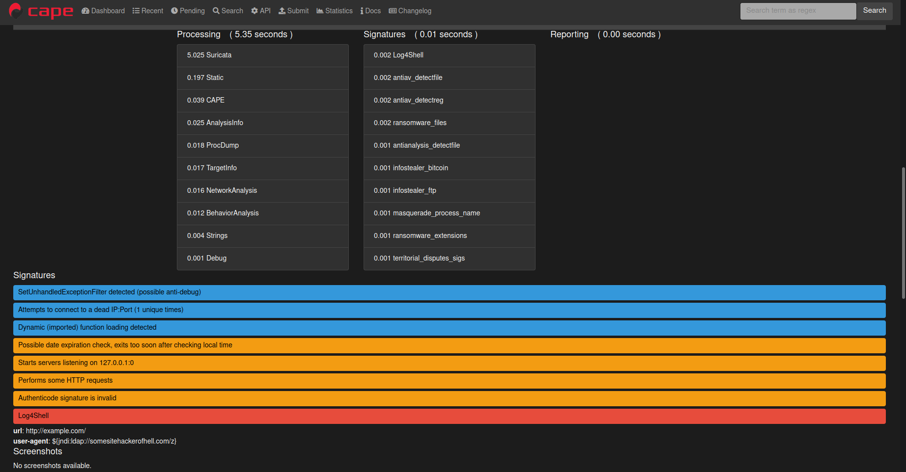
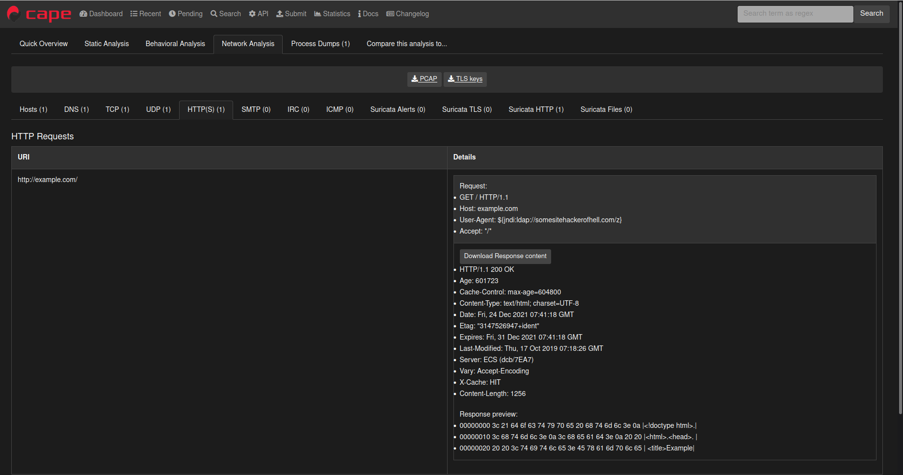
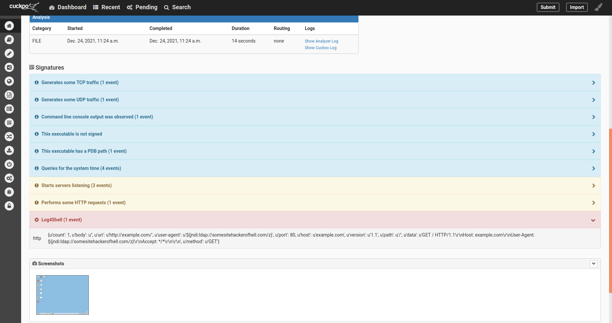
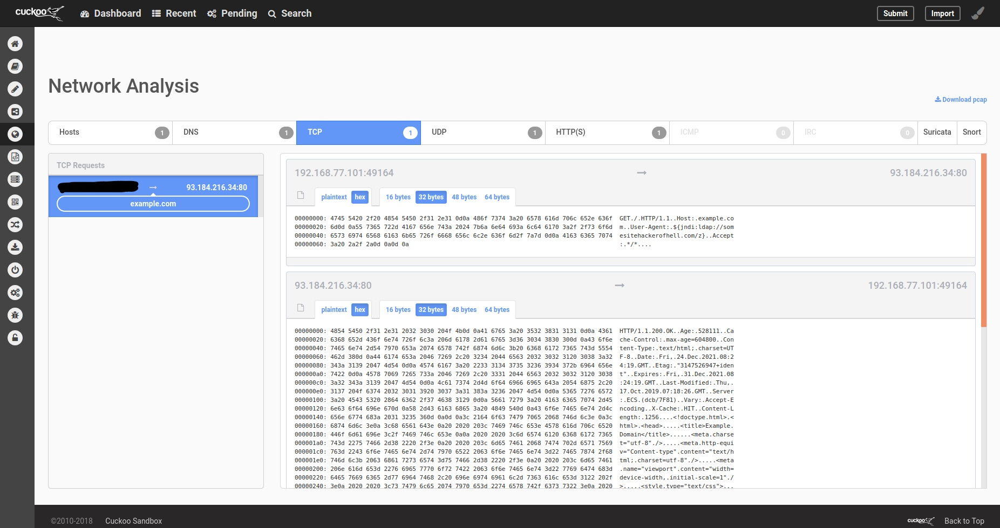

# Log4Shell-Sandbox-Signature
Log4Shell(CVE-2021-45046) Sandbox Signature

Regex : https://github.com/back2root/log4shell-rex

- Cape Sandbox Signature

   

   

- Cuckoo Sandbox Signature

   

   

